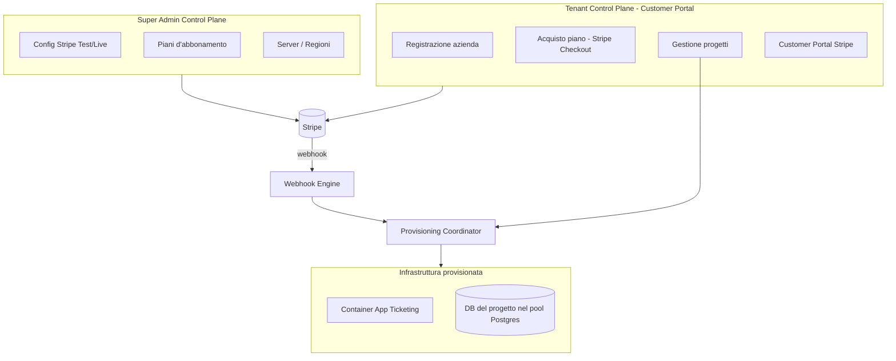
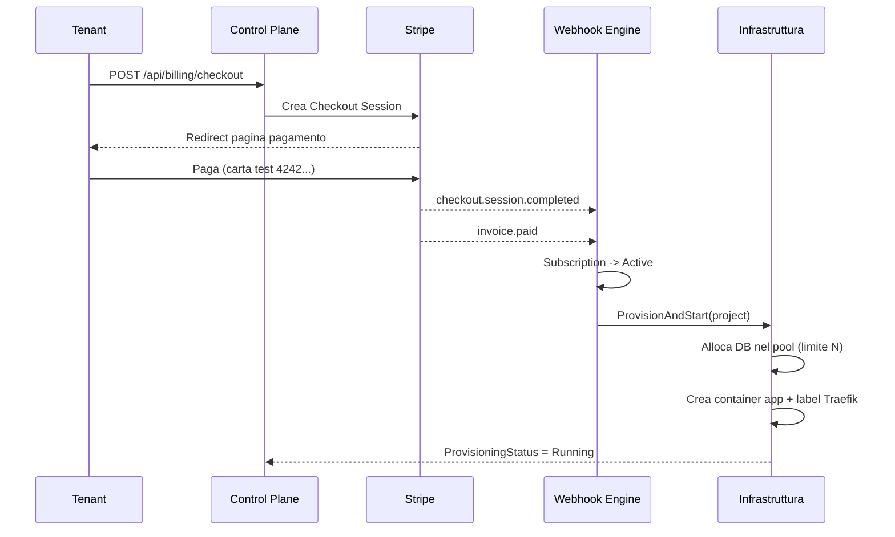
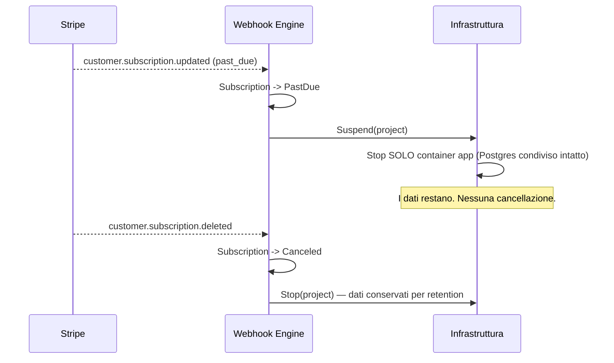

# 01 — Architettura

## Visione d'insieme

Aski è una piattaforma SaaS B2B che vende software di ticketing in modalità
single-tenant: ogni cliente ottiene una propria istanza isolata (container app +
database dedicato). La fatturazione Stripe pilota direttamente il ciclo di vita
dell'infrastruttura, sul modello di provisioning di Supabase.



## Le tre macro-aree

### 1. Super Admin Control Plane
Pannello del proprietario del SaaS. Funzioni:
- inserimento chiavi Stripe (Secret, Publishable, Webhook Secret) con toggle **Test/Live**;
- creazione **piani** (prezzo, valuta, periodo) sincronizzati con i listini Stripe;
- gestione **server/regioni** e del limite *N* di progetti per container Postgres.

Progetto: `Aski.ControlPlane` (controller `AdminStripeController`, `AdminServersController`).

### 2. Tenant Control Plane (Customer Portal)
Portale dove le aziende:
- si registrano;
- scelgono un piano e pagano via **Stripe Checkout**;
- gestiscono i **progetti** (istanze ticketing) scegliendo solo il server/regione;
- gestiscono carta/disdetta via **Stripe Customer Portal**.

Progetto: `Aski.ControlPlane` (controller `TenantsController`, `BillingController`).

### 3. Ticketing Application (istanza del cliente)
Software di supporto isolato single-tenant. Backend API C# con tre ruoli
(Admin, Dev, Client). Database dedicato dentro il pool Postgres del server scelto.

Progetto: `Aski.Ticketing.Api`.

## Flusso di attivazione (happy path)



## Flusso di sospensione (insoluto / disdetta)



## Principi architetturali

1. **Billing come sorgente di verità**: lo stato dell'abbonamento determina lo stato
   dei container. Nessun avvio/spegnimento manuale fuori da questa logica.
2. **Configurazione Stripe a runtime**: chiavi e modalità Test/Live lette dal DB, non
   da file di configurazione → cambiabili senza redeploy.
3. **Idempotenza dei webhook**: ogni evento Stripe processato una sola volta.
4. **Isolamento dati per database fisico**: l'istanza ticketing non ha colonne di
   tenant-id; l'isolamento è il database dedicato nel pool.
5. **Astrazione infrastruttura**: `IInfrastructureProvider` disaccoppia la logica di
   business dal backend concreto (VPS Docker / AWS ECS).
6. **Sicurezza dei segreti**: chiavi Stripe cifrate a riposo; firma webhook verificata.

## Mappa dei progetti

```
Aski.slnx
└── src/
    ├── Aski.Shared/            # enum/contratti condivisi del Control Plane
    ├── Aski.ControlPlane/      # API Super Admin + Tenant Portal + billing + provisioning
    │   ├── Entities/           # StripeSettings, Plan, Server, DbContainer, Tenant, ...
    │   ├── Data/               # ControlPlaneDbContext + migrations
    │   ├── Services/Stripe/    # context provider, StripeService, webhook handler
    │   ├── Services/Infrastructure/  # provider, factory, modelli Docker/Traefik
    │   ├── Services/Provisioning/    # coordinatori (Docker / Logging)
    │   └── Controllers/        # admin, tenant, billing, webhook
    └── Aski.Ticketing.Api/     # API istanza single-tenant
        ├── Domain/             # entità + enum ticketing
        ├── Data/               # TicketingDbContext + migrations
        ├── Auth/               # JWT, claim, ruoli
        └── Controllers/        # auth, tickets, management
```
