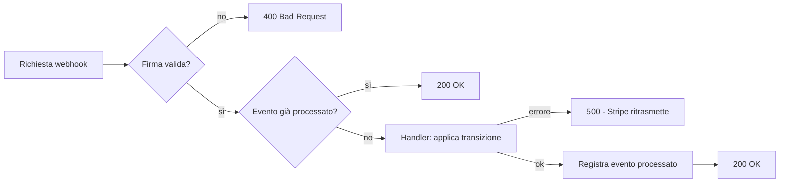

# 03 — Stripe & Billing

## Modalità billing (decisa dal Super Admin)

`StripeSettings.Mode` (enum `StripeMode`) è una scelta del **Super Admin**, non del cliente:

| Modalità | Cosa fa |
|----------|---------|
| `Simulated` (default) | Billing finto: l'acquisto del cliente attiva subito abbonamento e provisioning, **nessuna chiamata a Stripe**. |
| `Test` | Stripe sandbox (chiavi `*_test`). |
| `Live` | Stripe produzione (chiavi `*_live`). |

Il cliente preme sempre solo **Attiva**; è la modalità a decidere se si passa da Stripe o no.

## Configurazione delle chiavi

Le chiavi sono nella riga singola `StripeSettings` (Id = 1). **Due set completi** (Test e
Live) coesistenti: cambiare modalità non distrugge l'altro ambiente. In `Simulated` le
chiavi non servono.

| Campo | Cifrato a riposo | Note |
|-------|------------------|------|
| `TestSecretKey` / `LiveSecretKey` | ✅ | `sk_test_...` / `sk_live_...` |
| `TestWebhookSecret` / `LiveWebhookSecret` | ✅ | `whsec_...` |
| `TestPublishableKey` / `LivePublishableKey` | ❌ | pubblica (`pk_...`) |
| `Mode` | — | `Simulated` / `Test` / `Live` |

La cifratura usa ASP.NET DataProtection tramite un `ValueConverter` EF Core
(`EncryptedConverter`, purpose `Aski.StripeSecrets.v1`). In memoria i valori sono in
chiaro, in colonna sono ciphertext. **Non cambiare il purpose** o i dati esistenti
diventano illeggibili.

`IStripeContextProvider.GetAsync()` legge la riga, decifra, e restituisce un
`StripeContext` con un `StripeClient` autenticato sulla chiave attiva (lancia se la
modalità è `Simulated`, dove Stripe non va usato).

## Piani

Un `Plan` corrisponde a un Price di Stripe = un singolo periodo. Per offrire mensile
e annuale dello stesso prodotto si creano due piani con stesso `StripeProductId` ma
`StripePriceId`/`Period` diversi.

`StripeService.SyncPlanAsync`:
1. crea/aggiorna il **Product**;
2. crea un **Price** (immutabile su Stripe): se importo/valuta/periodo cambiano,
   disattiva il vecchio price e ne crea uno nuovo, aggiornando `StripePriceId`.

`Amount` è in **unità minime** della valuta (es. `1999` = 19,99 €). `Currency` è ISO-4217
minuscola (`eur`, `usd`). `Period`: `0 = Monthly`, `1 = Annual`.

## Acquisto — Stripe Checkout

`StripeService.CreateCheckoutSessionAsync`:
- crea il `Customer` Stripe del tenant se mancante (e lo salva su `Tenant.StripeCustomerId`);
- crea una **Checkout Session** `mode=subscription` con il price del piano;
- inietta i **metadata** `tenantId` e `planId` sia sulla sessione sia sulla subscription,
  così il webhook può correlare la subscription risultante.

Il Customer Portal reindirizza il browser all'`Url` restituito.

## Gestione — Stripe Customer Portal

`StripeService.CreateCustomerPortalSessionAsync` crea una sessione di Billing Portal
(cambio carta, disdetta) e restituisce l'URL di redirect.

## Webhook engine

Endpoint: `POST /api/stripe/webhook` (`StripeWebhookController`).



- **Firma**: `EventUtility.ConstructEvent(json, Stripe-Signature, webhookSecret)`.
  Senza firma valida → `400`.
- **Idempotenza**: l'`event.id` è salvato in `ProcessedStripeEvents`. Un evento già
  visto restituisce subito `200`. In caso di errore di elaborazione l'evento **non**
  viene marcato come processato, così Stripe ritrasmette.

## Macchina a stati dell'abbonamento

`StripeWebhookHandler` mappa gli eventi sullo stato interno e pilota l'infrastruttura.

| Evento Stripe | Stato interno | Azione infrastruttura |
|---------------|---------------|------------------------|
| `checkout.session.completed` | crea Subscription (Pending) | — (correla tenant/plan) |
| `invoice.paid` | `Active` | `ProvisionAndStart` (o `Resume` se prima sospeso) |
| `customer.subscription.created/updated` (active) | `Active` | `ProvisionAndStart` / `Resume` |
| `customer.subscription.updated` (past_due) | `PastDue` | `Suspend` |
| `customer.subscription.updated` (unpaid) | `Suspended` | `Suspend` |
| `customer.subscription.deleted` | `Canceled` | `Stop` (dati conservati) |

Mappatura stato Stripe → interno (`MapStatus`):

```
active | trialing            -> Active
past_due                     -> PastDue
unpaid                       -> Suspended
canceled | incomplete_expired-> Canceled
(altro: incomplete)          -> Pending
```

> Nota Stripe.net v52: l'id subscription della fattura è in
> `invoice.Parent.SubscriptionDetails.SubscriptionId`; il periodo corrente è sugli
> item (`subscription.Items.Data[].CurrentPeriodEnd`).

## Test in sandbox

```powershell
stripe listen --forward-to https://localhost:5001/api/stripe/webhook
# il comando stampa il whsec_... da inserire come TestWebhookSecret
```

Carte di test: `4242 4242 4242 4242` (ok), `4000 0000 0000 0341` (pagamento fallito).
Vedi [06 — API Control Plane](06-api-control-plane.md) per la sequenza completa di chiamate.

## Raccomandazione di produzione

Il webhook deve rispondere `200` entro ~10s. Il provisioning attuale è inline; in
produzione spostare le operazioni pesanti (creazione container) su un **background
worker** (Hangfire / `Channel` / coda) e rispondere subito a Stripe.
