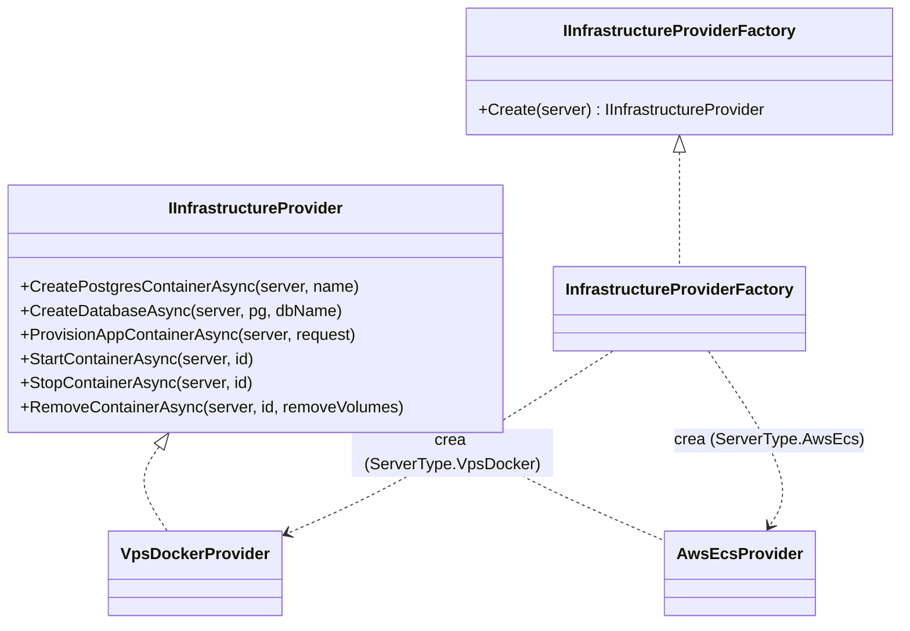
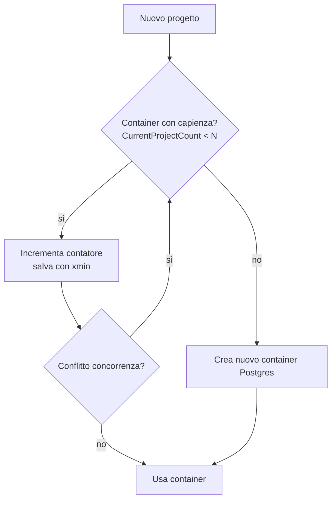

# 04 — Infrastruttura & Provisioning

## Astrazione



La factory sceglie l'implementazione in base a `Server.Type`:
- `VpsDocker` → `VpsDockerProvider` (Docker.DotNet + Traefik)
- `AwsEcs` → `AwsEcsProvider` (**stub**, da completare con AWS SDK)

## Configurazione del server (`Server.ConfigJson`)

Deserializzata in `ServerDockerConfig`:

```json
{
  "dockerHost": "tcp://10.0.0.5:2376",
  "network": "traefik",
  "appImage": "registry.example.com/aski-ticketing:latest",
  "postgresImage": "postgres:16-alpine",
  "certResolver": "le",
  "entrypoint": "websecure",
  "pgAdminUser": "postgres",
  "pgAdminPassword": "***",
  "domainSuffix": "aski.app"
}
```

## VpsDockerProvider

### Container applicativo + Traefik

`ProvisionAppContainerAsync` crea il container dall'immagine `appImage`, lo aggancia
alla rete `network` e applica le label Traefik:

```
traefik.enable = true
traefik.docker.network = <network>
traefik.http.routers.<r>.rule = Host(`acme.aski.app`) || Host(`support.acme.com`)
traefik.http.routers.<r>.entrypoints = websecure
traefik.http.routers.<r>.tls = true
traefik.http.routers.<r>.tls.certresolver = le
traefik.http.services.<r>.loadbalancer.server.port = 8080
```

`<r>` = nome del container sanificato. Il dominio personalizzato (`CustomDomain`) viene
aggiunto come secondo host se presente. TLS automatico via certresolver (Let's Encrypt).

### Database logico

`CreateDatabaseAsync` si connette al Postgres del pool con le credenziali admin ed
esegue `CREATE DATABASE`. Il nome è **validato e quotato** (`QuoteIdentifier`):
solo lettere/cifre/underscore, max 63 caratteri → niente SQL injection sull'identificatore.

### Suspend / Resume / Stop

- `StopContainerAsync` ferma il container (grace 30s) **senza** rimuoverlo → dati intatti.
- `StartContainerAsync` riavvia.
- `RemoveContainerAsync(removeVolumes:true)` cancella (irreversibile) — solo per
  deprovisioning definitivo post-retention.

> Suspend/Stop a livello di **coordinatore** fermano solo il container applicativo:
> il container Postgres è condiviso e non va mai fermato (impatterebbe altri progetti).

## Pool Postgres — N progetti per container

Ogni progetto ottiene un database logico in un container Postgres condiviso, fino al
limite `Server.MaxProjectsPerDbContainer` (*N*). Raggiunto *N*, si crea un nuovo container.



### Concorrenza

`DbContainer.Version` è mappato sull'`xmin` di Postgres come **concurrency token**.
`DockerProvisioningCoordinator.AllocateDbContainerAsync`:
1. seleziona il container con meno progetti e capienza (`!IsFull && count < N`);
2. incrementa `CurrentProjectCount`, imposta `IsFull` se raggiunge *N*;
3. `SaveChanges`: se un altro provisioning ha modificato la riga →
   `DbUpdateConcurrencyException` → **retry** (fino a 5 volte);
4. se nessun container ha capienza → ne crea uno nuovo.

Questo evita che due provisioning concorrenti superino *N* sullo stesso container.

## Coordinatore di provisioning

`IProvisioningCoordinator` è il ponte tra stato abbonamento e infrastruttura.

| Metodo | Quando | Effetto |
|--------|--------|---------|
| `ProvisionAndStartAsync` | abbonamento Active (primo) | alloca DB nel pool, crea database, avvia container app |
| `ResumeAsync` | Active dopo sospensione | riavvia il container app (o provisiona se mai fatto) |
| `SuspendAsync` | PastDue / unpaid | ferma il container app, dati conservati |
| `StopAsync` | Canceled | ferma il container app, dati conservati per retention |

Due implementazioni, scelte da `Provisioning:Mode`:
- `DockerProvisioningCoordinator` (`Docker`) — provisioning reale.
- `LoggingProvisioningCoordinator` (`Logging`) — placeholder: aggiorna solo
  `Project.ProvisioningStatus` e logga. Utile per testare il billing senza Docker.

## Variabili iniettate nell'istanza ticketing

Al provisioning, il container app riceve:

```
ConnectionStrings__Tenant = Host=<pgHost>;Port=5432;Database=proj_<id>;Username=...;Password=...
Aski__ProjectId           = <id progetto>
```

(In produzione iniettare anche `Jwt__Key` e le credenziali seed dell'admin per istanza.)
