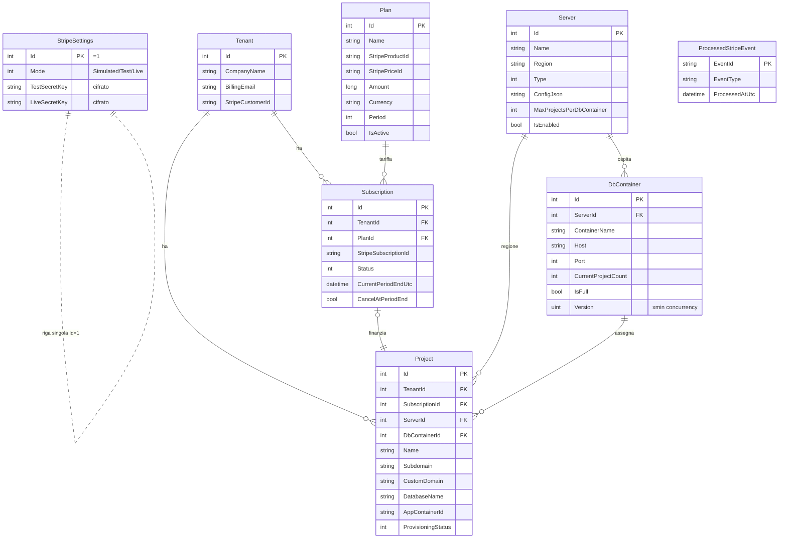
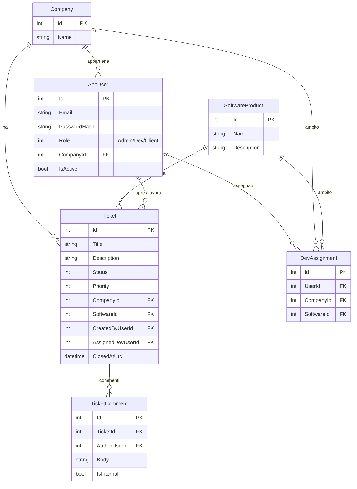

# 05 — Modello dati

Due database distinti: **Control Plane** e **istanza Ticketing**.

## Database Control Plane

### Enum (Aski.Shared)

| Enum | Valori |
|------|--------|
| `BillingPeriod` | `Monthly=0`, `Annual=1` |
| `SubscriptionStatus` | `Pending=0`, `Active=1`, `PastDue=2`, `Suspended=3`, `Canceled=4` |
| `ServerType` | `VpsDocker=0`, `AwsEcs=1` |
| `ProvisioningStatus` | `NotProvisioned=0`, `Provisioning=1`, `Running=2`, `Stopped=3`, `Failed=4` |
| `StripeMode` | `Simulated=0`, `Test=1`, `Live=2` |
| `PortalUserRole` | `SuperAdmin=0`, `TenantOwner=1` |

Altre tabelle del Control Plane: `PortalUser` (login: SuperAdmin/TenantOwner, password BCrypt),
`AuditLog` (operazioni sensibili), `Project.DbUser`/`DbPassword` (credenziali DB dedicate, password cifrata).

### Note di mapping

- `StripeSettings.Id` non auto-incrementa (riga singola, Id=1).
- Segreti Stripe cifrati via `EncryptedConverter` (DataProtection).
- `Plan.StripePriceId` indice unico (filtrato).
- `DbContainer.Version` = `xmin` (concurrency token Npgsql).
- `Subscription.StripeSubscriptionId` indice unico.
- `Project.Subdomain` indice unico; cascate: Tenant→(Subscription,Project) cascade,
  riferimenti a Server/DbContainer su delete `SetNull`.

## Database istanza Ticketing

### Enum (Aski.Ticketing.Api.Domain)

| Enum | Valori |
|------|--------|
| `TicketRole` | `Admin=0`, `Dev=1`, `Client=2` |
| `TicketStatus` | `Open=0`, `InProgress=1`, `Waiting=2`, `Resolved=3`, `Closed=4` |
| `TicketPriority` | `Low=0`, `Normal=1`, `High=2`, `Urgent=3` |

### Regole

- `AppUser.Email` indice unico; i Client devono avere `CompanyId`.
- `DevAssignment` con `CompanyId` e `SoftwareId` entrambi nulli = accesso totale (Dev senza vincoli).
- Indice unico `(UserId, CompanyId, SoftwareId)` per evitare assegnazioni duplicate.
- `Ticket` indice `(CompanyId, Status)` per le query filtrate per azienda.
- `TicketComment.IsInternal` = nota visibile solo a Dev/Admin.
