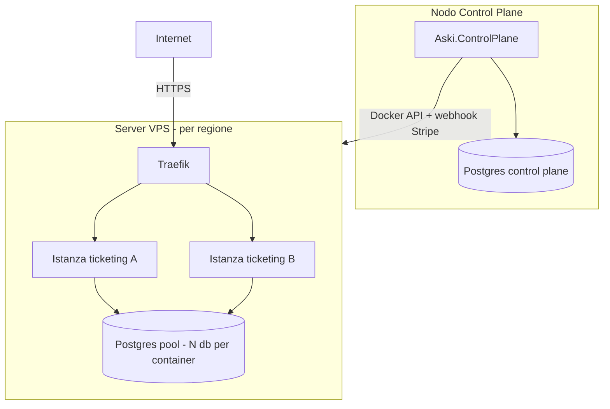

# 09 — Deployment

## Topologia



## Control Plane

- Esegue come container o servizio. Espone gli endpoint admin/tenant/billing/webhook.
- Richiede accesso al demone Docker di ogni server VPS gestito (via `dockerHost` in
  `Server.ConfigJson`), tipicamente `tcp://host:2376` con TLS, o tunnel/SSH.
- Variabili d'ambiente:
  - `ConnectionStrings__ControlPlane`
  - `DataProtection__KeyRingPath` (montare un volume persistente; condiviso se multi-replica)
  - `Portal__BaseUrl` (per success/cancel/return URL di Stripe)
  - `Provisioning__Mode=Docker`

## Server VPS

Prerequisiti su ogni server:
- Docker con API raggiungibile dal Control Plane.
- **Traefik** in ascolto, con un entrypoint `websecure` e un certresolver (es. Let's
  Encrypt) configurati, agganciato alla rete Docker `network` (default `traefik`).
- DNS: wildcard `*.<domainSuffix>` che punta al server (per i sottodomini dei progetti);
  per i domini personalizzati, il tenant fa puntare il proprio record al server.

### Esempio Traefik (statico, estratto)

```yaml
entryPoints:
  websecure:
    address: ":443"
certificatesResolvers:
  le:
    acme:
      email: ops@aski.app
      storage: /acme.json
      httpChallenge:
        entryPoint: web
providers:
  docker:
    exposedByDefault: false
    network: traefik
```

Le label sui container app (generate da `VpsDockerProvider`) fanno il resto del routing.

## Immagine dell'istanza Ticketing

- Build dell'immagine `Aski.Ticketing.Api` (porta interna `8080`).
- Pubblicarla su un registry accessibile dai server (`appImage` in `ConfigJson`).
- Variabili iniettate al provisioning:
  - `ConnectionStrings__Tenant` (database del progetto nel pool)
  - `Aski__ProjectId`
  - `Jwt__Key`, `Seed__AdminEmail`, `Seed__AdminPassword` (consigliato)

Esempio Dockerfile (riferimento):

```dockerfile
FROM mcr.microsoft.com/dotnet/aspnet:10.0 AS base
WORKDIR /app
EXPOSE 8080
ENV ASPNETCORE_URLS=http://+:8080

FROM mcr.microsoft.com/dotnet/sdk:10.0 AS build
WORKDIR /src
COPY . .
RUN dotnet publish src/Aski.Ticketing.Api -c Release -o /app/publish

FROM base AS final
WORKDIR /app
COPY --from=build /app/publish .
ENTRYPOINT ["dotnet", "Aski.Ticketing.Api.dll"]
```

## Postgres pool

- I container Postgres del pool sono creati dal `VpsDockerProvider` (`postgresImage`).
- Per la produzione: montare volumi persistenti, configurare backup e definire la
  politica di retention dei database dei progetti cancellati.

## Scaling e affidabilità

- **Control Plane multi-replica**: condividere il key-ring DataProtection e usare il
  DB come unico stato. Rendere il provisioning idempotente (già impostato via
  `ProcessedStripeEvents` e controlli di stato).
- **Provisioning asincrono**: introdurre un background worker/coda per non bloccare la
  risposta ai webhook (< 10s).
- **Osservabilità**: log strutturati già presenti; aggiungere metriche su provisioning
  e conteggio progetti per container (saturazione del limite *N*).

## Pipeline CI (suggerita)

```text
restore -> build (Aski.slnx) -> test -> ef migrations bundle -> docker build/push
```

> Le migration del Control Plane si applicano con `dotnet ef database update` o un
> bundle; l'istanza Ticketing applica le proprie migration all'avvio (`Seed:ApplyMigrations`).
